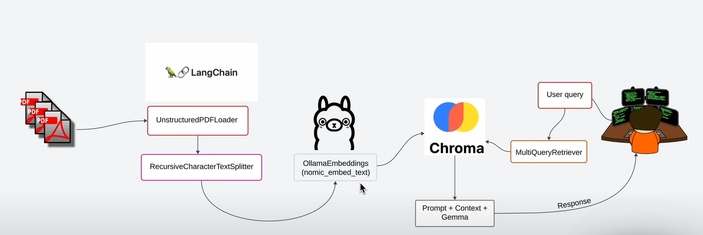

# 🤖 ChatBot PDF – RAG avec LangChain, Flask, React & Ollama

Ce projet est une démonstration complète d’un **chatbot intelligent** qui lit et comprend des documents PDF en français. Il repose sur une architecture **RAG (Retrieval-Augmented Generation)** avec LangChain, une API Flask et un front React connecté.

---

## 🧠 Architecture (avec schéma)

Voici un aperçu visuel du pipeline :



### Étapes :
1. **PDFs** chargés avec `UnstructuredPDFLoader`
2. **Chunking** via `RecursiveCharacterTextSplitter`
3. **Embeddings** générés avec `OllamaEmbeddings` (modèle `nomic-embed-text`)
4. **Stockage vectoriel** via `Chroma`
5. **Requête utilisateur** traitée par `MultiQueryRetriever` pour une recherche plus intelligente
6. **Réponse générée** avec contexte + prompt
7. **Interface React** pour poser des questions

---

## 🧱 Stack technique

- **LangChain** (RAG + gestion des documents)
- **Ollama** (local LLM + embeddings)
- **ChromaDB** (base vectorielle locale)
- **Flask** (API en Python)
- **React** (UI frontend)
- **Create React App**

---

## 🚀 Lancer le projet

### 🧩 1. Prérequis

- Python 3.10+ recommandé
- Node.js ≥ v18
- Ollama installé localement : [https://ollama.com](https://ollama.com)
- Git + navigateur pour GitHub

---

### 📦 2. Installation du backend (API + Embeddings)

```bash
cd backend
python3 -m venv .venv
source .venv/bin/activate
pip install -r requirements.txt
```

➕ Charger les PDF et créer la base vectorielle

Place tes PDF dans backend/docs/, puis lance :

```bash
python build_index.py --reset
```

▶️ Lancer l’API Flask

```bash
python api.py
```

---

###  💻 3. Lancer le frontend React

```bash
cd frontend
npm install
npm start
```

Application accessible sur : http://localhost:3000

---

### 📂 Structure du projet

chatbot-ui/
├── backend/
│   ├── api.py               ← API Flask
│   ├── build_index.py       ← Création base vectorielle
│   ├── query_data.py        ← Core RAG logic
│   ├── docs/                ← Dossiers PDF
│   ├── chroma/              ← Base vectorielle générée
│   ├── requirements.txt
├── frontend/
│   ├── src/                 ← React app
│   ├── public/
│   └── package.json
├── README.md
└── .gitignore
